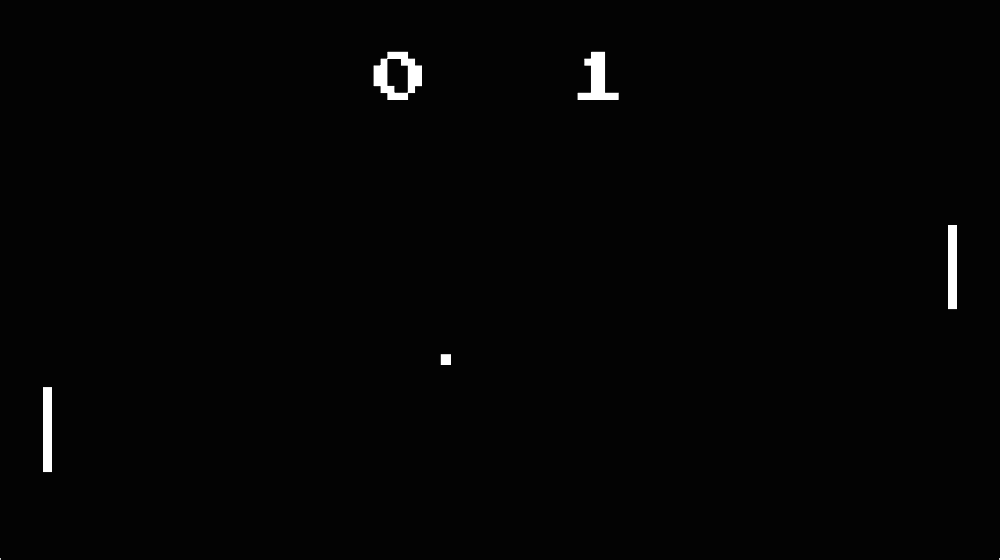

# Pong

## Introduction

After covering <a href="https://github.com/svanimpe/fx-game-loops">game loops</a>, I wanted to continue my explorations into game programming and build a complete game. What better game to start with than good old Pong?



The topics covered in this example are:

- A game loop with variable time steps.
- Game objects.
- Keyboard controls.
- Collision detection and 'faked physics'.
- A simple AI to control the opponent paddle.
- Multiple screens and switching between them.
- Sound effects.
- Scaling the screen while respecting the aspect ratio, using letter- and pillarboxing.

## Running on iOS

Right after finishing this game in JavaFX, I started the experiment of porting it to iOS, mainly to learn more about <a href="http://www.robovm.com/">RoboVM</a>. After a bit of research and asking questions on the <a href="https://groups.google.com/forum/#!forum/robovm">RoboVM Google group</a>, I got the game running on my iPhone 5 and wondered if Apple would accept it into the App Store. After a bit more research and asking questions on said Google group, I finally had a valid and signed IPA, sent it to Apple and crossed my fingers. Much to my surprise, on May 16th the light turned green and Pong (rebranded as Retro Game I to avoid angry letters from Atari) was available on the App Store. For a while I thought this was the first JavaFX app on the App Store. That turned out not to be the case (it was the second one), but as far as I know it still is the first open source one 😁

Even though the iOS port has some issues (and I've removed the game from the App Store because of them), this has been a fun, exciting and successful experiment. For those of you wanting to try out JavaFX on iOS for yourself, I'll spend the remainder of this post recapping the steps I took to port the game to iOS and publish it to the App Store. Note that I used an early version of RoboVM and haven't updated this post in almost a year. I'll revisit it when RoboVM 1.0 is released.

The source code for this port is in the `ios` branch . It requires JDK 7.

### Prerequisites

You will need a Mac with Xcode installed and a JavaFX project to start from. I'll be using the RoboVM Maven plugin, so you'll need to use Maven for your project. My initial POM contained the following:

```xml
<groupId>svanimpe</groupId>
<artifactId>pong</artifactId>
<version>1.0-SNAPSHOT</version>
<packaging>jar</packaging>

<name>Pong</name>
<url>https://github.com/svanimpe/fx-pong</url>

<properties>
    <project.build.sourceEncoding>UTF-8</project.build.sourceEncoding>
    <maven.compiler.source>1.7</maven.compiler.source>
    <maven.compiler.target>1.7</maven.compiler.target>
    <mainClass>svanimpe.pong.ui.Pong</mainClass>
</properties>

<dependencies>
    <dependency>
        <groupId>com.oracle</groupId>
        <artifactId>javafx</artifactId>
        <version>2.2</version>
        <scope>system</scope>
        <systemPath>${java.home}/lib/jfxrt.jar</systemPath>
    </dependency>
</dependencies>
```

I also added `-Xbootclasspath/a:"${env.JAVA_HOME}/jre/lib/jfxrt.jar"` to all my NetBeans actions in `nbactions.xml`, to add `jfxrt.jar` to the boot classpath. You can do the same in your POM if you don't use NetBeans, but since I will use `nbactions.xml` again later on, I did it this way. Just make sure `java.home` refers to JRE 7, not 8. With this you should be able to run your JavaFX Maven project. Try it out and fix any issues before you continue.

### Prepare for RoboVM

RoboVM does not support Java 8 so make sure you're not using any Java 8 language features or API. RoboVM uses a backport of OpenJFX 8 so don't use anything from JavaFX 2 that has been removed in JavaFX 8. Also, audio is not yet supported on iOS. There probably are other unsupported features as well, but audio is the only one I needed to remove from Pong to get it running on iOS.

### Configure RoboVM

RoboVM uses `robovm.properties` and `robovm.xml` as configuration files, as well as `Info.plist.xml` which contains information about your application bundle. My files contain the following:

`robovm.properties`

```
app.version=1.0
app.id=svanimpe.pong
app.mainclass=svanimpe.pong.ui.iOSLauncher
app.executable=Pong
app.build=1
app.name=Retro Game I
```

`robovm.xml`

```xml
<?xml version="1.0" encoding="UTF-8"?>
<config>
    <executableName>${app.executable}</executableName>
    <mainClass>${app.mainclass}</mainClass>
    <os>ios</os>
    <arch>thumbv7</arch>
    <resources>
        <resource>
            <directory>resources</directory>
        </resource>
    </resources>
    <target>ios</target>
    <iosInfoPList>Info.plist.xml</iosInfoPList>
</config>
```

Of note here is the `resources` folder which contains the required icons, launch images, etc. See Apple's information on <a href="https://developer.apple.com/library/ios/documentation/iPhone/Conceptual/iPhoneOSProgrammingGuide/ExpectedAppBehaviors/ExpectedAppBehaviors.html#//apple_ref/doc/uid/TP40007072-CH3-SW9">Required Resources</a> to figure out what files you need.

`Info.plist.xml`

```xml
<?xml version="1.0" encoding="UTF-8"?>
<!DOCTYPE plist PUBLIC "-//Apple//DTD PLIST 1.0//EN" "http://www.apple.com/DTDs/PropertyList-1.0.dtd">
<plist version="1.0">
    <dict>
        <key>CFBundleDevelopmentRegion</key>
        <string>en</string>
        <key>CFBundleDisplayName</key>
        <string>${app.name}</string>
        <key>CFBundleExecutable</key>
        <string>${app.executable}</string>
        <key>CFBundleIdentifier</key>
        <string>${app.id}</string>
        <key>CFBundleInfoDictionaryVersion</key>
        <string>6.0</string>
        <key>CFBundleName</key>
        <string>${app.name}</string>
        <key>CFBundlePackageType</key>
        <string>APPL</string>
        <key>CFBundleShortVersionString</key>
        <string>${app.version}</string>
        <key>CFBundleSignature</key>
        <string>????</string>
        <key>CFBundleVersion</key>
        <string>${app.build}</string>
        <key>NSHumanReadableCopyright</key>
        <string>Copyright © 2014 Steven Van Impe. All rights reserved.</string>
        <key>LSRequiresIPhoneOS</key>
        <true/>
        <key>UIDeviceFamily</key>
        <array>
            <integer>1</integer>
        </array>
        <key>UIRequiredDeviceCapabilities</key>
        <array>
            <string>armv7</string>
            <string>opengles-2</string>
        </array>
        <key>UISupportedInterfaceOrientations</key>
        <array>
            <string>UIInterfaceOrientationLandscapeRight</string>
        </array>
    </dict>
</plist>
```

See Apple's <a href="https://developer.apple.com/library/mac/documentation/General/Reference/InfoPlistKeyReference/Introduction/Introduction.html">Information Property List Key Reference</a> for more information on what the different keys mean.

The last part of the configuration is to add RoboVM to your dependencies:

```xml
<dependency>
    <groupId>org.robovm</groupId>
    <artifactId>robovm-rt</artifactId>
    <version>0.0.12</version>
</dependency>
<dependency>
    <groupId>org.robovm</groupId>
    <artifactId>robovm-cocoatouch</artifactId>
    <version>0.0.12</version>
</dependency>
```

and configure the plugin:

```xml
<plugin>
    <groupId>org.robovm</groupId>
    <artifactId>robovm-maven-plugin</artifactId>
    <version>0.0.12.1</version>
    <configuration>
        <propertiesFile>robovm.properties</propertiesFile>
        <configFile>robovm.xml</configFile>
        <includeJFX>true</includeJFX>
    </configuration>
</plugin>
```

### Launcher class

The final piece of the puzzle is the launcher class. This is an implementation of a `UIApplicationDelegate` required by iOS:

```java
public class iOSLauncher extends UIApplicationDelegateAdapter
{
    @Override
    public boolean didFinishLaunching(UIApplication application,
                                      NSDictionary launchOptions)
    {
        Thread fxThread = new Thread(new Runnable()
        {
            @Override
            public void run()
            {
                Application.launch(Pong.class);
            }
        });
        fxThread.setDaemon(true);
        fxThread.start();
        return true;
    }
    
    public static void main(String... args)
    {
        System.setProperty("glass.platform", "ios");
        System.setProperty("prism.text", "native");
        
        NSAutoreleasePool pool = new NSAutoreleasePool();
        UIApplication.main(args, null, iOSLauncher.class);
        pool.drain();
    }
}
```

This class is completely reusable. Simply replace `Pong.class` with your JavaFX Application subclass.

### Running on a simulator

After all this you should be able to run your app on the simulator with the Maven goals `robovm:iphone-sim` and `robovm:ipad-sim`. If you prefer the convenience of NetBeans, add the following actions to your `nbactions.xml`:

```xml
<action>
    <actionName>CUSTOM-device</actionName>
    <displayName>Run on device</displayName>
    <goals>
        <goal>robovm:ios-device</goal>
    </goals>
</action>
<action>
    <actionName>CUSTOM-iphone</actionName>
    <displayName>Run on iPhone simulator</displayName>
    <goals>
        <goal>robovm:iphone-sim</goal>
    </goals>
</action>
<action>
    <actionName>CUSTOM-ipad</actionName>
    <displayName>Run on iPad simulator</displayName>
    <goals>
        <goal>robovm:ipad-sim</goal>
    </goals>
</action>
<action>
    <actionName>CUSTOM-ipa</actionName>
    <displayName>Build IPA</displayName>
    <goals>
        <goal>robovm:create-ipa</goal>
    </goals>
</action>
```

These include the actions to run your app on a device and to build an IPA, which we'll need in the following sections.

### Running on a device

If you want to run your app on a device, you'll need:

- an iOS developer account.
- to provision your device for development.

Follow Apple's steps on how to <a href="https://developer.apple.com/library/ios/documentation/ToolsLanguages/Conceptual/Xcode_Overview/RunYourApp.html">run your app on a connected device</a> then connect the device and run the Maven goal `robovm:ios-device` or use the custom NetBeans action from the previous section.

### Submit to the App Store

First go to <a href="https://itunesconnect.apple.com/">iTunes Connect</a> and create a new <a href="https://developer.apple.com/library/ios/documentation/IDEs/Conceptual/AppDistributionGuide/UsingiTunesConnect/UsingiTunesConnect.html">App Record</a>. It should be in the status 'Waiting For Upload'. Then, similar to what you did in the previous section, create a signing identity and provisioning profile for distribution. It's easy enough through Xcode. Apple has more on this in the <a href="https://developer.apple.com/library/ios/documentation/IDEs/Conceptual/AppDistributionGuide/SubmittingYourApp/SubmittingYourApp.html">App Distribution Guide</a>.

Next, configure the RoboVM Maven plugin to use your distribution (not development) signing identity and provisioning profile. My configuration is as follows:

```xml
<plugin>
    <groupId>org.robovm</groupId>
    <artifactId>robovm-maven-plugin</artifactId>
    <version>0.0.12.1</version>
    <configuration>
        <propertiesFile>robovm.properties</propertiesFile>
        <configFile>robovm.xml</configFile>
        <includeJFX>true</includeJFX>
        <iosSignIdentity>iPhone Distribution</iosSignIdentity>
        <iosProvisioningProfile>F40BF4FD-D09A-4548-8667-EE6E819D3755</iosProvisioningProfile>
    </configuration>
</plugin>
```

The `iosProvisioningProfile` key refers to the UUID of your provisioning profile. To find this value, go to the <a href="https://developer.apple.com/membercenter/">Apple Developer Member Center</a>, download your distribution provisioning profile and open the downloaded file in TextEdit (or `cat` it on the command line).

With your signing identity and profile set up, you should be able to generate an IPA with the Maven goal `robovm:create-ipa` or using the custom NetBeans action. Finally, use Application Loader (it comes with Xcode) to submit your IPA. If your IPA contains all the required assets, and it's signed correctly, you should be fine. All that's left now is to sit back and wait a few days for your app to be reviewed.

> **Note**: This repository contains a Maven project. It was last tested using NetBeans 8.0.2 and JDK 8u25.
